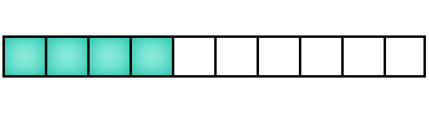

# rangepicker.js



## Installation

Pre build files can be found in the ```/build``` folder.

Include ```rangepicker.js``` and(optionally) ```rangepicker.css``` in your project.

## Usage

```html
<div id="rangePicker"></div>
```
```javascript
var element = document.getElementById('rangePicker');
var rp = rangepicker(element, options);
```

## API

### Properties

Property | Description
--- | ---
`element` | Element where you would like to initialize ```rangepicker.js```. |
`options` | An object containing configuration options. Pass ```{}``` for defaults. |

#### Options

Option | Description
--- | ---
`range` | An object containing range options. It consists of ```size```, ```step``` and ```value``` parameters. |
`disabled` | Default ```false```. If ```true``` component will be disabled.

### Methods

Usage: ```rp.methodName()```

Method | Description
--- | ---
`setValue(value)` | Sets given value. |
`getValue()` | Returns the component current value. |
`enable()` | Enables component. |
`disable()` | Disables component. |
`on(event, handler)` | Adds event listener. |

## Contribution

Feel free to contribute.
